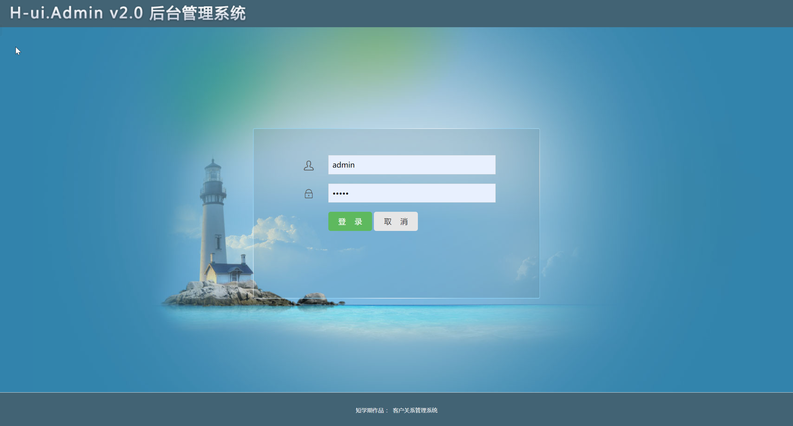
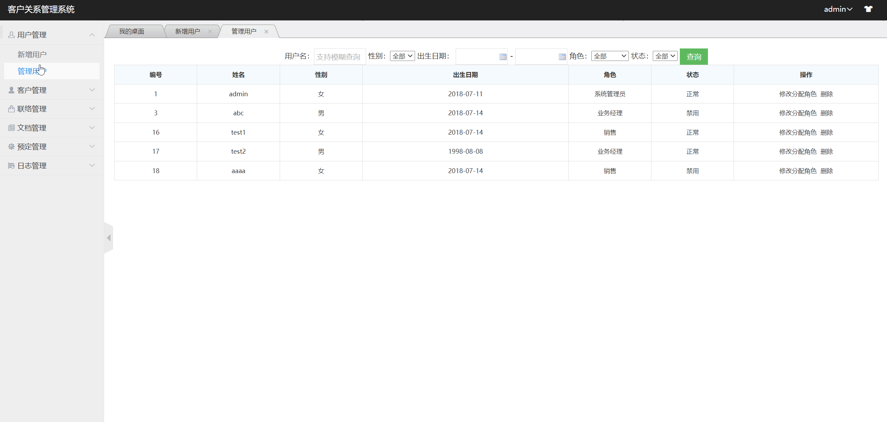
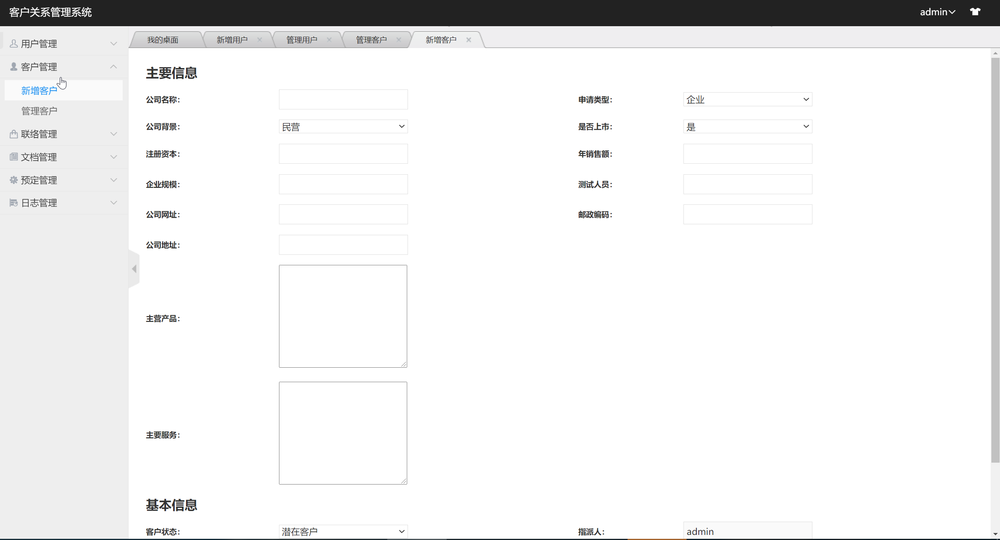
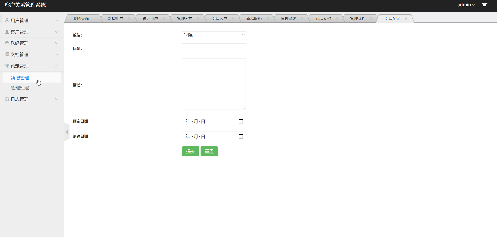

基于Springboot的客户关系管理系统（CRM）
=
### 完整代码获取地址：从戎源码网 ([https://armycodes.com/](https://armycodes.com/))
### 作者微信：19941326836  QQ：952045282 
### 承接计算机毕业设计、Java毕业设计、Python毕业设计、深度学习、机器学习
### 选题+开题报告+任务书+程序定制+安装调试+论文+答辩ppt 一条龙服务
### 所有选题地址https://github.com/nature924/allProject

一、项目介绍
---
基于SpringBoot框架的实现的客户关系管理系统（CRM），主要功能如下

### 【后台功能】
权限管理模块: 包括系统的登录与注册功能
用户管理模块: 基于RBAC的权限模型设计, 实现分配角色的功能功能
客户管理模块: 对客户信息进行新增 修改 删除 查看
联络信息管理模块: 对联络信息进行增删改查
文档管理模块: 对文档进行管理
预订管理模块: 可以新增预订, 查询修改删除预订信息
日志管理模块: 新增管理日志

二、项目技术
---
- 编程语言：Java
- 数据库：MySQL
- 项目管理工具：Maven
- 前端技术：VUE、HTML、Jquery、Bootstrap
- 后端技术：Spring、SpringMVC、MyBatis

三、运行环境
---
- 操作系统：Windows、macOS都可以
- JDK版本：JDK1.8以上都可以
- 开发工具：IDEA、Ecplise、Myecplise都可以
- 数据库: MySQL5.7以上都可以
- Tomcat：任意版本都可以
- Maven：任意版本都可以

四、运行截图
---
### 论文截图：

### 程序截图：

